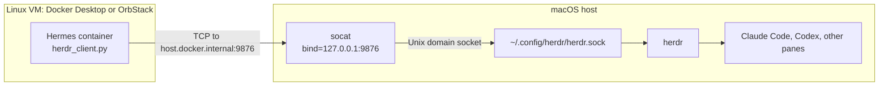
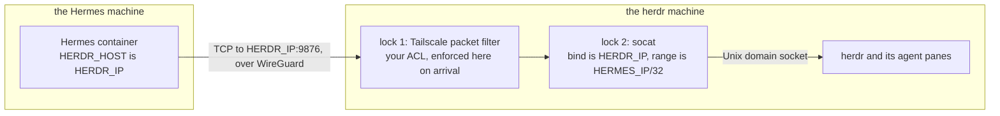
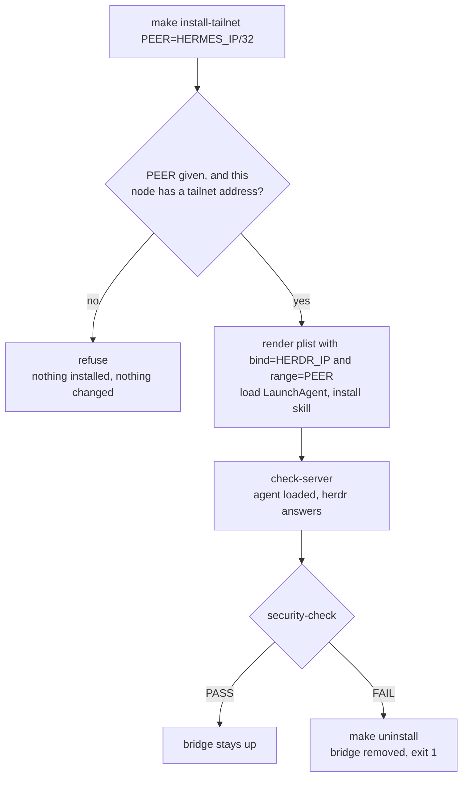

# hermes-herdr-bridge

Lets a Hermes agent running in a container drive [herdr](https://herdr.dev)-managed coding agents on the macOS host.

herdr listens on a Unix domain socket. Hermes runs in a Linux container, which on macOS means a Linux VM (Docker Desktop, OrbStack). Bind-mounting the socket does not work — the file shows up inside the container but connecting fails with `ConnectionRefusedError: [Errno 111]`, because a macOS Unix socket means nothing inside the VM. Only TCP crosses that boundary.



The box boundary is the whole problem: herdr's socket lives in the macOS box, and nothing in the VM box can open it. TCP is the only thing that crosses.

## Runtime support

The host half — socat under launchd — knows nothing about Docker. The container half needs two things: `host.docker.internal` must resolve, and it must reach a listener bound to `127.0.0.1` on the host.

| Runtime | Status |
|---|---|
| OrbStack | verified |
| Docker Desktop for Mac | expected to work unchanged — ships `host.docker.internal`, and its proxy originates traffic on the host, so loopback listeners are reachable. Not verified here |
| Other macOS runtimes (Colima, Rancher, plain Lima) | untested. If `host.docker.internal` is missing, run containers with `--add-host=host.docker.internal:host-gateway` or point `HERDR_HOST` at a reachable address. If it resolves but the connection is refused, that VM cannot see host loopback — `make install BIND=<addr>`, narrowest address that works |
| Docker Engine on Linux | **don't use this** — mount the Unix socket into the container directly. The bridge exists only because of the macOS→VM boundary |

`make check` is the portability gate: it runs the real client from a real container and fails, with both fallbacks spelled out, on a runtime that cannot reach the bridge.

This repo is the source of truth for both halves: the host `socat` LaunchAgent and the Hermes skill that talks to it.

## Use

```bash
brew install socat
make install      # one machine: loopback bridge, skill, verify
make check        # bridge state, bind scope, host + container reachability, config
make security-check   # assert the exposure is contained (run by install-tailnet as a gate)
make uninstall    # remove both
```

For herdr and Hermes on *different* machines, see [Two machines, over Tailscale](#two-machines-over-tailscale).

`make help` lists the rest (`restart`, `test`, `logs`, `config`) and the overridable vars — `PORT`, `BIND`, `LABEL`, `SOCKET`, `SKILL_DIR`, `CHECK_IMAGE`, …

`make install` writes two generated things — edit the repo, never them:

| Generated | From |
|---|---|
| `~/Library/LaunchAgents/local.herdr-socat.plist` | `launchd/local.herdr-socat.plist.in` |
| `~/.hermes/skills/autonomous-ai-agents/herdr/` | `skill/` |

The skill is **copied, not symlinked** — Hermes bind-mounts `~/.hermes/skills` into the container, where a symlink pointing back into `~/Workspace` would dangle.

## Two machines, over Tailscale

herdr on one machine, Hermes on another, joined by a tailnet. Each machine installs one half; neither installs both. Both names start with H, so this document spells them out rather than abbreviating: the **herdr machine** and the **Hermes machine**, addressed as `HERDR_IP` and `HERMES_IP`.

|  | the herdr machine | the Hermes machine |
|---|---|---|
| runs | herdr, socat LaunchAgent | Hermes + its container runtime |
| needs | `socat`, Tailscale | Tailscale, Docker |
| installs | `make install-tailnet` | `make install-client` |



Both locks live on the herdr machine and are set independently: the ACL on Tailscale's coordination server, the `range=` allowlist in that machine's own LaunchAgent. Each half is configured with the **other** machine's address — Hermes dials `HERDR_IP`, herdr admits only `HERMES_IP`. That mutual dependency is why step 0 is collecting both.

### 0. Both machines: collect the two addresses

Each half is configured with the *other* machine's address, so get both before starting. On each machine:

```bash
tailscale ip -4        # App Store build: /Applications/Tailscale.app/Contents/MacOS/Tailscale ip -4
```

Call them `HERDR_IP` and `HERMES_IP`. Confirm they can see each other: `tailscale ping <other>`.

### 1. Machine H — install the bridge

```bash
git clone https://github.com/scaryPonens/hermes-herdr-bridge && cd hermes-herdr-bridge
brew install socat
make install-tailnet PEER=<HERMES_IP>/32
```

Binds socat to the herdr machine's own tailnet address — reachable over WireGuard, invisible to the LAN — with `range=<HERMES_IP>/32` in front of it, so it refuses connections from anywhere else regardless of what your ACL says. Then it runs `security-check`, and **if that fails it uninstalls the bridge** rather than leaving it exposed. herdr must be running there, or the check fails with `herdr closed the connection`.

### 2. Tailnet — restrict the port

In your Tailscale ACL (see [What guards this](#what-guards-this) for why this is not optional):

```json
{"grants": [
  {"src": ["tag:hermes"], "dst": ["tag:herdr"], "ip": ["tcp:9876"]}
]}
```

### 3. Machine M — point Hermes at H

Edit `~/.hermes/config.yaml` under `terminal:` — `make config HERDR_HOST=<HERDR_IP>` prints the exact block:

```yaml
  docker_extra_args:
    - "-e"
    - "HERDR_HOST=<HERDR_IP>"
    - "-e"
    - "HERDR_PORT=9876"
```

Use the IP, not the MagicDNS name: containers usually don't inherit the host's `100.100.100.100` resolver, so the name fails inside the container while the IP works.

### 4. Machine M — install the Hermes half and verify

```bash
git clone https://github.com/scaryPonens/hermes-herdr-bridge && cd hermes-herdr-bridge
make install-client HERDR_HOST=<HERDR_IP>
```

Installs the skill only — no socat, no LaunchAgent, nothing listening on the Hermes machine — then runs `check-client`: config assertions plus a real container dialing `<HERDR_IP>:9876` through the tailnet. A green run here means Hermes can drive the agents on the herdr machine.

Restart the Hermes session so a new container picks up the env vars (`container_persistent: false` means within ~5 minutes anyway).

### Re-verifying later

`make check-server` and `make security-check` on the herdr machine; `make check-client HERDR_HOST=<HERDR_IP>` on the Hermes machine. `make check` on either machine will fail, because it asserts both halves are local.

### What guards this

`install-tailnet` will not leave a bridge running that fails its own check:



The bridge has no auth and no TLS of its own. Across machines it gets three independent layers, and `make security-check` is the gate:

| Layer | Enforced by | Verified by security-check |
|---|---|---|
| Only tailnet traffic can arrive | binding to the 100.x address | yes — asserts `BIND` is an address Tailscale assigned this node, and rejects `0.0.0.0` |
| Only one host may connect | socat `range=` | yes — asserts the allowlist is in the *loaded* LaunchAgent, and that it's a real address inside `100.64.0.0/10` |
| Not published to the internet | no Tailscale Funnel | yes — fails if `funnel status` mentions the port, or if it can't read funnel state at all |
| Only the Hermes node is permitted | your Tailscale ACL | **no** — an ACL lives on the coordination server, not here |

That last row is why the `range=` allowlist exists: it does not depend on your ACL being right. Set the ACL too — belt and braces:

```json
{"grants": [
  {"src": ["tag:hermes"], "dst": ["tag:herdr"], "ip": ["tcp:9876"]}
]}
```

Understand what you are permitting: reaching this port means submitting prompts to interactive coding agents with shell and filesystem access on the herdr machine. It is remote code execution by design. Never `tailscale funnel` it.

### Serving both at once

`install-tailnet` replaces the loopback listener, so a Hermes container on the herdr machine itself stops reaching the bridge. To serve both, run a second LaunchAgent on its own label and port — no code change needed, both are vars:

```bash
make install                                                    # loopback, port 9876
make install-tailnet PEER=100.101.102.103/32 \
     LABEL=local.herdr-socat-tailnet PORT=9877
```

## The one manual step

`~/.hermes/config.yaml` is Hermes's own file, hand-edited rather than generated. It needs:

```yaml
terminal:
  docker_extra_args:
    - "-e"
    - "HERDR_HOST=host.docker.internal"
    - "-e"
    - "HERDR_PORT=9876"
```

and must not bind-mount the herdr socket. `make config` prints this; `make check` fails if the env vars are missing or a stale `/run/herdr` mount reappears.

## Security

- The listener binds **127.0.0.1**. Containers under Docker Desktop and OrbStack reach a host loopback listener through `host.docker.internal`, so binding wider buys nothing and would expose herdr — full control of your local coding agents — to the LAN. `BIND` exists for runtimes that provably cannot reach loopback; `make check` warns loudly whenever the listener is not loopback-only. Reach for `--add-host`/`HERDR_HOST` before reaching for `BIND`, and never use `0.0.0.0` on an untrusted network.
- The bridge has no auth. Anything that can open a loopback TCP connection on the host, including any other container, can drive herdr. Same trust boundary as the socket's file permissions, minus the file mode — fine on a single-user laptop, not on a shared or exposed machine.

## Layout

```
Makefile
bin/security-check.sh                 # the gate: fails closed, explains what it can't verify
launchd/local.herdr-socat.plist.in    # KeepAlive + RunAtLoad, bind + listener opts
skill/SKILL.md                        # how Hermes should drive herdr
skill/scripts/herdr_client.py         # stdlib client: library + CLI
skill/scripts/test_herdr_client.py    # framing / timeout / error self-check
skill/references/docker-tcp-bridge.md # setup, failure modes
skill/references/*.md                 # protocol, CLI cheat sheet, diagnostics
```

The client speaks herdr's newline-delimited JSON and exposes `health`, `list-agents`, `get-agent`, `prompt-agent`, `wait-agent`, `read-pane`, `send-input`, `send-keys`; anything else goes through `call(method, params)`.

```bash
CLIENT=/root/.hermes/skills/autonomous-ai-agents/herdr/scripts/herdr_client.py
python3 $CLIENT health
python3 $CLIENT prompt-agent w8:p1 "run the tests"
python3 $CLIENT wait-agent w8:p1 --timeout 590000
```
